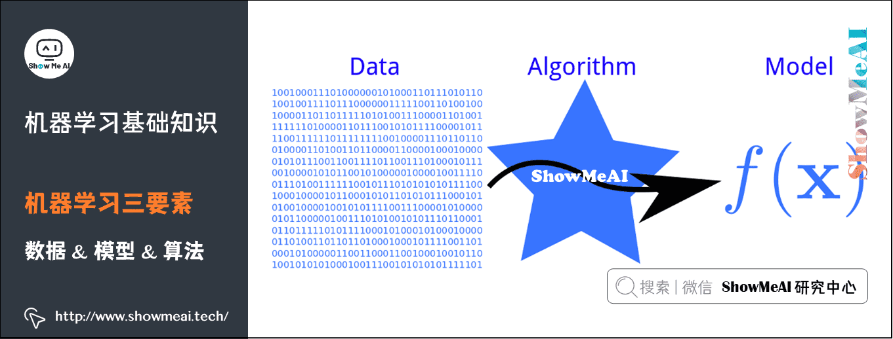
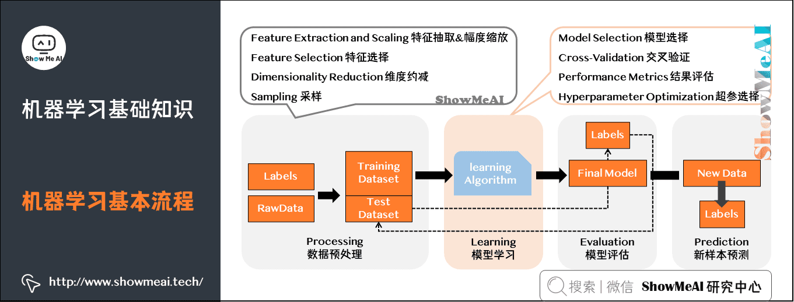
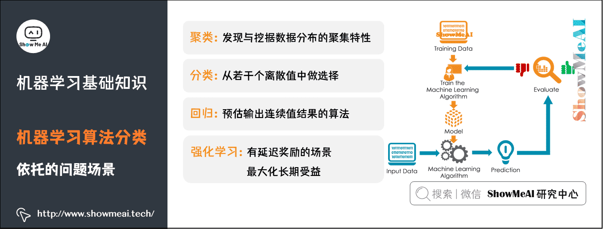
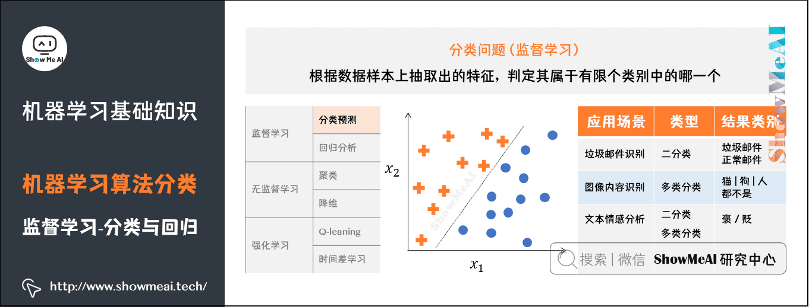
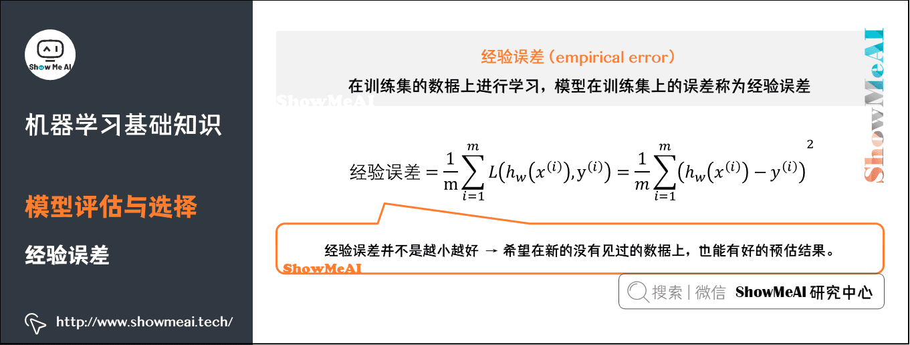

# Refer
+ 图解机器学习算法：从入门到精通系列教程: https://www.showmeai.tech/tutorials/34
+ 机器学习实战：手把手教你玩转机器学习系列: https://www.showmeai.tech/tutorials/41
+ 

# 简介

## 定义

**机器学习研究的是计算机怎样模拟人类的学习行为，以获取新的知识或技能，并重新组织已有的知识结构，使之不断改善自身**。从实践的意义上来说，机器学习是在大数据的支撑下，通过各种算法让机器对数据进行深层次的统计分析以进行「自学」，使得人工智能系统获得了归纳推理和决策能力

**机器学习（Machine learning）是人工智能的子集，是实现人工智能的一种途径，但并不是唯一的途径**。它是一门专门研究计算机怎样模拟或实现人类的学习行为，以获取新的知识或技能，重新组织已有的知识结构使之不断改善自身的性能的学科。大概在上世纪80年代开始蓬勃发展，诞生了一大批数学统计相关的机器学习模型。

**深度学习（Deep learning）是机器学习的子集，灵感来自人脑，由人工神经网络（ANN）组成，它模仿人脑中存在的相似结构**。在深度学习中，学习是通过相互关联的「神经元」的一个深层的、多层的「网络」来进行的。「深度」一词通常指的是神经网络中隐藏层的数量。大概在2012年以后爆炸式增长，广泛应用在很多的场景中。

## 机器学习三要素

机器学习三要素包括**数据**、**模型**、**算法**。这三要素之间的关系，可以用下面这幅图来表示：

## 机器学习核心技术

- **分类**：应用以分类数据进行模型训练，根据模型对新样本进行精准分类与预测。

- **聚类**：从海量数据中识别数据的相似性与差异性，并按照最大共同点聚合为多个类别。

- **异常检测**：对数据点的分布规律进行分析，识别与正常数据及差异较大的离群点。

- **回归**：根据对已知属性值数据的训练，为模型寻找最佳拟合参数，基于模型预测新样本的输出值。

## 机器学习基本流程

机器学习工作流（WorkFlow）包含数据**预处理**（Processing）、**模型学习**（Learning）、**模型评估**（Evaluation）、**新样本预测**（Prediction）几个步骤。

- **数据预处理**：输入（未处理的数据 + 标签）→处理过程（特征处理+幅度缩放、特征选择、维度约减、采样）→输出（测试集 + 训练集）。
- **模型学习**：模型选择、交叉验证、结果评估、超参选择。
- **模型评估**：了解模型对于数据集测试的得分。
- **新样本预测**：预测测试集。

## 机器学习基本名词

- **标记**：关于示例结果的信息，如（（色泽=青绿，根蒂=蜷缩，敲声=浊响），好瓜），其中「好瓜」称为标记。
- **示例/样本**：上面一条数据集中的一条数据。
- **属性/特征**：「色泽」「根蒂」等。
- **属性空间/样本空间/输入空间X**：由全部属性张成的空间。
- **特征向量**：空间中每个点对应的一个坐标向量。
- **分类**：若要预测的是离散值，如「好瓜」，「坏瓜」，此类学习任务称为分类。
- **假设**：学得模型对应了关于数据的某种潜在规律。
- **真相**：潜在规律自身。
- **学习过程**：是为了找出或逼近真相。
- **泛化能力**：学得模型适用于新样本的能力。一般来说，训练样本越大，越有可能通过学习来获得具有强泛化能力的模型。

## 机器学习算法分类

**监督学习**：从给定的训练数据集中学习出一个函数，当新的数据到来时，可以根据这个函数预测结果。监督学习的训练集要求是包括输入和输出，也可以说是特征和目标。<u>训练集中的目标是由人标注的</u>。常见的监督学习算法包括回归分析和统计分类。

**无监督学习**：与监督学习相比，训练集<u>没有人为标注</u>的结果。常见的无监督学习算法有生成对抗网络（GAN）、聚类。

**强化学习**：通过观察来学习做成如何的动作。每个动作都会对环境有所影响，学习对象根据观察到的周围环境的反馈来做出判断。

### 分类问题

分类问题的目标是根据已知样本的某些特征，判断一个新的样本属于哪种已知的样本类。分类问题可以细分如下：

- **二分类问题**：表示分类任务中有两个类别新的样本属于哪种已知的样本类。
- **多类分类**（Multiclass classification）问题：表示分类任务中有多类别。
- **多标签分类**（Multilabel classification）问题：给每个样本一系列的目标标签。

了解更多机器学习分类算法：[**KNN算法**](https://www.showmeai.tech/article-detail/187)、[**逻辑回归算法**](https://www.showmeai.tech/article-detail/188)、[**朴素贝叶斯算法**](https://www.showmeai.tech/article-detail/189)、[**决策树模型**](https://www.showmeai.tech/article-detail/190)、[**随机森林分类模型**](https://www.showmeai.tech/article-detail/191)、[**GBDT模型**](https://www.showmeai.tech/article-detail/193)、[**XGBoost模型**](https://www.showmeai.tech/article-detail/194)、[**支持向量机模型**](https://www.showmeai.tech/article-detail/196)等。

### 回归问题

根据数据样本上抽取出的特征，预测连续值结果。

了解更多机器学习回归算法：[**决策树模型**](https://www.showmeai.tech/article-detail/190)、[**随机森林分类模型**](https://www.showmeai.tech/article-detail/191)、[**GBDT模型**](https://www.showmeai.tech/article-detail/193)、[**回归树模型**](https://www.showmeai.tech/article-detail/192)、[**支持向量机模型**](https://www.showmeai.tech/article-detail/196)等。

### 聚类问题

**聚类**（Clustering）是最常见的无监督学习算法，它指的是按照某个特定标准（如距离）把一个数据集分割成不同的类或簇，使得同一个簇内的数据对象的相似性尽可能大，同时不在同一个簇中的数据对象的差异性也尽可能地大。也即聚类后同一类的数据尽可能聚集到一起，不同类数据尽量分离。

聚类算法在很多场景下都有应用，例如新闻自动分组，用户分群，图像分割等等。很多时候，无监督的聚类算法，得到的聚类结果还可以作为特征在后续监督学习中应用，提升整体效果。

### 降维问题

在互联网大数据场景下，我们经常需要面对高维数据，在对这些数据做分析和可视化的时候，我们通常会面对「高维」这个障碍。在数据挖掘和建模的过程中，高维数据也同样带来大的计算量，占据更多的资源，而且许多变量之间可能存在相关性，从而增加了分析与建模的复杂性。

主成分分析（Principal Components Analysis，简称PCA）是最重要的数据降维方法之一。在数据压缩消除冗余和数据噪音消除等领域都有广泛的应用。

降维问题的核心是**实现对高维数据用低维数据进行表达;数据映射**

## 机器学习模型评估的基本名词

### 机器学习与数据拟合

机器学习最典型的监督学习为分类与回归问题。分类问题中，我们学习出来一条「决策边界」完成数据区分；在回归问题中，我们学习出拟合样本分布的曲线。

### 训练集与数据集

- **训练集**（Training Set）：帮助训练模型，简单的说就是通过训练集的数据让确定拟合曲线的参数。
- **测试集**（Test Set）：为了测试已经训练好的模型的精确度。

当然，test set这并不能保证模型的正确性，只是说相似的数据用此模型会得出相似的结果。因为在训练模型的时候，参数全是根据现有训练集里的数据进行修正、拟合，有可能会出现过拟合的情况，即这个参数仅对训练集里的数据拟合比较准确，这个时候再有一个数据需要利用模型预测结果，准确率可能就会很差。

### 经验误差

在训练集的数据上进行学习。模型在训练集上的误差称为「经验误差」（Empirical Error）。但是经验误差并不是越小越好，因为我们希望在新的没有见过的数据上，也能有好的预估结果。

### 过拟合与欠拟合

**过拟合**发生在模型对训练数据学习得“太好了”，以至于它几乎记住了数据的每一个细节。这种模型在训练数据上的表现可能非常好，但是当面对新的、未见过的数据时，其表现通常会下降，因为它无法很好地泛化。过拟合通常是因为模型太复杂，例如参数过多或者训练时间过长，导致它捕捉到数据中的噪声和偶然的模式，而不仅仅是真正的信号。

相对地，**欠拟合**则发生在模型对训练数据的学习不足，无法捕捉数据中的基本模式。通常这会导致模型在训练数据上的表现就不好，同时在新数据上的表现也不好。欠拟合可能是由于模型太简单（如参数太少或模型设计不足以捕捉数据的复杂性），或者是因为训练不充分（例如训练迭代次数太少）。

**如何防止过拟合呢**？一般的方法有Early Stopping、数据集扩增（Data Augmentation）、正则化、Dropout等。

- **正则化**：指的是在目标函数后面添加一个正则化项，一般有L1正则化与L2正则化。L1正则是基于L1范数，即在目标函数后面加上参数的L1范数和项，即参数绝对值和与参数的积项。
- **数据集扩增**：即需要得到更多的符合要求的数据，即和已有的数据是独立同分布的，或者近似独立同分布的。一般方法有：从数据源头采集更多数据、复制原有数据并加上随机噪声、重采样、根据当前数据集估计数据分布参数，使用该分布产生更多数据等。
- **DropOut**：通过修改神经网络本身结构来实现的。

- **使用交叉验证**：通过这种方式可以更准确地评估模型对未知数据的泛化能力。
- **调整模型复杂度**：对于过拟合，可以尝试减少模型的复杂度（如减少参数、层数等）；对于欠拟合，则可能需要增加模型的复杂度。
- **早停法（Early Stopping）**：在训练过程中，如果验证数据的性能开始下降，那么停止训练可以防止过拟合。

### 偏差

**偏差**（**Bias**），**它通常指的是模型拟合的偏差程度**。给定无数套训练集而期望拟合出来的模型就是平均模型。偏差就是真实模型和平均模型的差异。

简单模型是一组直线，平均之后得到的平均模型是一条直的虚线，与真实模型曲线的差别较大（灰色阴影部分较大）。因此，**简单模型通常高偏差** 。

复杂模型是一组起伏很大波浪线，平均之后最大值和最小组都会相互抵消，和真实模型的曲线差别较小，因此复杂模型通常低偏差（见黄色曲线和绿色虚线几乎重合）。

### 方差

**方差（Variance），它通常指的是模型的平稳程度（简单程度）**。简单模型的对应的函数如出一辙，都是水平直线，而且平均模型的函数也是一条水平直线，因此简单模型的方差很小，并且对数据的变动不敏感。

复杂模型的对应的函数千奇百怪，毫无任何规则，但平均模型的函数也是一条平滑的曲线，因此复杂模型的方差很大，并且对数据的变动很敏感。

### 偏差与方差的平衡

简单模型偏差大, 与真实模型差距较大, 对训练集学习不足, 但是同时在新数据上的表现也不好。唯一的优点是平稳(平稳地表现不好XD:)。

复杂模型偏差小, 与真实模型差距较小, 复杂模型的方差很大，且对数据的变动很敏感。存在的问题在于会对训练集学习的太好了, 导致当面对新的、未见过的数据时，其表现通常会下降，即过拟合。

## 模型调优与选择准则

我们希望找到对当前问题表达能力好，且模型复杂度较低的模型：

- 表达力好的模型，可以较好地对训练数据中的规律和模式进行学习；
- 复杂度低的模型，方差较小，不容易过拟合，有较好的泛化表达。

### 机器学习模型评估的性能度量指标

**性能度量是衡量模型泛化能力的数值评价标准，反映了当前问题（任务需求）**。使用不同的性能度量可能会导致不同的评判结果。更详细的内容可见 [**模型评估方法与准则**](https://www.showmeai.tech/article-detail/186)

#### 回归问题

关于模型「好坏」的判断，不仅取决于算法和数据，还取决于当前任务需求。**回归问题常用的性能度量指标有：平均绝对误差、均方误差、均方根误差、R平方等**。

- **平均绝对误差**（**Mean Absolute Error，MAE**），又叫平均绝对离差，是所有标签值与回归模型预测值的偏差的绝对值的平均。
- **平均绝对百分误差**（**Mean Absolute Percentage Error，MAPE**）是对MAE的一种改进，考虑了绝对误差相对真实值的比例。
- **均方误差**（**Mean Square Error，MSE**）相对于平均绝对误差而言，均方误差求的是所有标签值与回归模型预测值的偏差的平方的平均。
- **均方根误差**（**Root-Mean-Square Error，RMSE**），也称标准误差，是在均方误差的基础上进行开方运算。RMSE会被用来衡量观测值同真值之间的偏差。
- **R平方 决定系数**，反映因变量的全部变异能通过目前的回归模型被模型中的自变量解释的比例。比例越接近于1，表示当前的回归模型对数据的解释越好，越能精确描述数据的真实分布。

#### 分类问题

**分类问题常用的性能度量指标包括错误率（Error Rate）、精确率（Accuracy）、查准率（Precision）、查全率（Recall）、F1、ROC曲线、AUC曲线和R平方等**。

- **错误率**：分类错误的样本数占样本总数的比例。
- **精确率**：分类正确的样本数占样本总数的比例。
- **查准率**（也称准确率），即在检索后返回的结果中，真正正确的个数占你认为是正确的结果的比例。
- **查全率**（也称召回率），即在检索结果中真正正确的个数，占整个数据集（检索到的和未检索到的）中真正正确个数的比例。
- 二分类混淆矩阵:
  - Prediction Positive: 预测为正	
  - Prediction Negative: 预测为负
  - Condition Positive: 实际为正
  - Condition Negative: 实际为负
  - **TP (True Positives)**：真正例，即模型正确地将正类预测为正类的实例数量。
  - **FP (False Positives)**：假正例，即模型错误地将负类预测为正类的实例数量。
  - **FN (False Negatives)**：假反例，即模型错误地将正类预测为负类的实例数量。
  - **TN (True Negatives)**：真反例，即模型正确地将负类预测为负类的实例数量。

- **F1**是一个综合考虑查准率与查全率的度量，其基于查准率与查全率的调和平均定义：即：F1度量的一般形式-Fβ，能让我们表达出对查准率、查全率的不同偏好。

+ **ROC曲线**: **ROC曲线（Receiver Operating Characteristic Curve）全称是「受试者工作特性曲线」**。综合考虑了概率预测排序的质量，体现了学习器在不同任务下的「期望泛化性能」的好坏, 曲线越接近左上角，表示该分类器的性能越好。ROC曲线的纵轴是「真正例率」（TPR），横轴是「假正例率」（FPR）。

+ **AUC（Area Under ROC Curve）是ROC曲线下面积，代表了样本预测的排序质量**。

  AUC：数值的范围从0到1, 高的AUC值意味着，AUC值越大，就能够保证ROC曲线越靠近左上方, 即模型的性能越好(以一个极端例子为例, AUC范围为1, 即代表全域覆盖, 则0%的假正例率时, 即可实现100%的真正例率)。

### 评估方法

如何可靠地评估？关键是要获得可靠的「测试集数据」（Test Set），即测试集（用于评估）应该与训练集（用于模型学习）「互斥」。

**常见的评估方法有：留出法（Hold-out）、交叉验证法（ Cross Validation）、自助法（Bootstrap）**。

#### 留出法

**留出法**（Hold-out）是机器学习中最常见的评估方法之一，它会从训练数据中保留出验证样本集，这部分数据不用于训练，而用于模型评估。

#### **交叉验证法**

**交叉验证法**（ **Cross Validation**）。k 折交叉验证对 k 个不同分组训练的结果进行平均来减少方差，每一组训练完成后, 使用下一组进行测试。因此模型的性能对数据的划分就不那么敏感，对数据的使用也会更充分，模型评估结果更加稳定。

> 留一法: k=样本总数(m), 做m次训练, 每组(每组只有一个样本)训练完后, 使用下一个进行测试

#### **自助法**

**自助法（Bootstrap）是一种用小样本估计总体值的一种非参数方法。**通过有放回抽样生成大量的伪样本，通过对伪样本进行计算，获得统计量的分布，从而估计数据的整体分布。

### 如何选择最优的模型

#### 验证集评估选择

- 切分数据为训练集和验证集。
- 对于准备好的候选超参数，在训练集上进行模型，在验证集上评估。

#### 网格搜索/随机搜索交叉验证

- 通过网格搜索/随机搜索产出候选的超参数组。
- 对参数组的每一组超参数，使用交叉验证评估效果。
- 选出效果最好的超参数。

#### 贝叶斯优化

- 基于贝叶斯优化的超参数调优。
