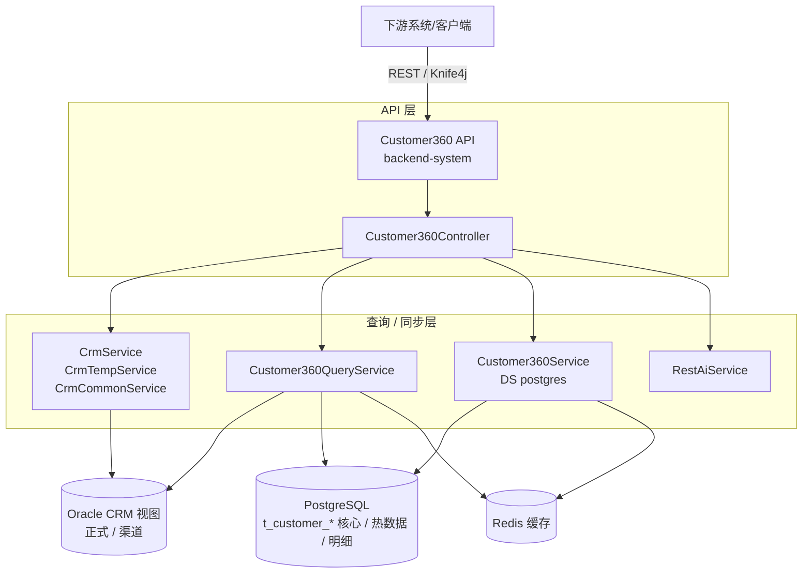

# short key
`ctrl + comman + 1,2,3` switch window

`ctrl + +/-` change paragraph

`ctrl + /` show origin code 

`ctrl + <- / -> ` to the line start / end

`command + shift + enter` table next line

## table

`alt + enter` table next line

`ctrl + shift + backspace` table delete line

`ctrl + shift + enter` add ` ` to this line

鼠标放在边界, 可以拖动

## typera -> docx pandoc style
https://www.cnblogs.com/fancy2022/p/16365046.html

> Modify style -> format -> 
>
> + font
> + paragraph
> + numbering
> + ...

+ normal text style
  + First Paragraph
  + Body Text
  + Normal
+ header \\###
  + Heading 1
  + Heading 2
  + Heading 3
  + Heading 4
  + ...

## typera order list, pdf export error

2em 为需要控制的空余量

## Mac下的Typora草稿/未保存恢复
https://blog.csdn.net/Sensente/article/details/125703890

## 自动图片替换
变动大会自动替换, 似乎有算法

# 流程图

（适用于 Mermaid 11.x、Typora 最新版）

